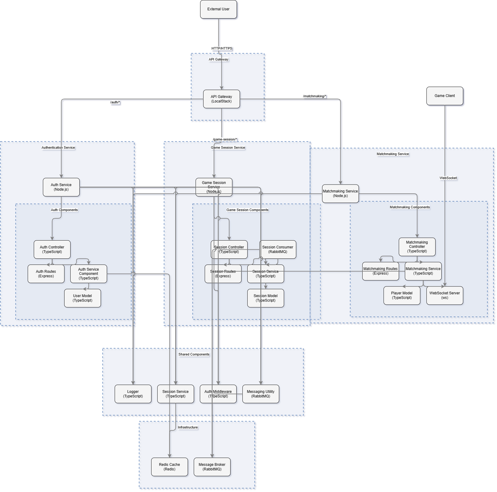

# Realm-of-Strategos

## Overview
**Realm-of-Strategos** is a backend microservices-based system for managing real-time multiplayer game sessions. It provides features like user authentication, player matchmaking, and game session lifecycle management.

---

## Architecture Diagram



---

## Architecture
This project leverages a distributed microservices architecture:
- **Auth-Service**: Handles user registration, login, and authentication with JWT.
- **Matchmaking-Service**: Matches players based on skill levels and assigns them to game sessions.
- **Game-Session-Service**: Manages the creation, retrieval, updating, and deletion of game sessions.

The project also utilizes `@maorte/strategos-services-common-package`:
- A shared **npm library** that provides reusable utilities for all services.  
  Includes:
  - **Logger**
  - **Messaging Utilities**

---

### Technologies
- **Backend**: Node.js, TypeScript
- **Databases**: Redis for caching and persistence
- **Messaging**: RabbitMQ for inter-service communication
- **WebSockets**: Real-time communication for matchmaking updates
- **API Gateway**: LocalStack emulation for centralized routing using AWS API Gateway
- **Documentation**: Swagger for API documentation
- **Testing**: Jest for unit and integration tests, Artillery for load testing
- **Logging**: Winston for structured, scalable logging
- **Orchestration**: Docker Compose for local development

---

### Features
- **User Authentication**: Secure login and registration with JWT tokens.
- **Skill-Based Matchmaking**: Dynamic player matching based on skill levels.
- **Game Session Management**: Complete lifecycle management of game sessions.
- **Real-Time Communication**: WebSocket integration for live updates.
- **Load Testing**: Simulate high traffic with Artillery.
- **Centralized API Gateway**: Manage routing to all microservices using LocalStack.
- **Reusable Utilities**: Modular shared library for streamlined development.

---

## How to Run Locally

1. **Clone the Repository**:
    ```bash
    git clone <repository-url>
    cd Realm-of-Strategos
    ```

2. **Set up Environment Variables**:
   Each service requires its own `.env` file. Refer to the individual service's README for details.

3. **Install Dependencies**:
   Install Node.js dependencies for all services:
    ```bash
    npm install
    ```

4. **Start Services**:
   Use Docker Compose to orchestrate services:
    ```bash
    docker-compose up --build
    ```

5. **View Swagger Documentation**:
   Access the API documentation for each service:
   - **Auth-Service**: [http://localhost:3000/api-docs](http://localhost:3000/api-docs)
   - **Matchmaking-Service**: [http://localhost:3002/api-docs](http://localhost:3002/api-docs)
   - **Game-Session-Service**: [http://localhost:3001/api-docs](http://localhost:3001/api-docs)

---
## Testing

### Unit and Integration Tests
Run tests for individual services:
```bash
cd auth-service
npm test

cd matchmaking-service
npm test

cd game-session-service
npm test

---
### Load Testing
Simulate high traffic with Artillery:
1. **Install Artillery**:
   ```bash
   npm install -g artillery
   ```
2. **Run Load Tests**:
   Use the predefined test configurations:
   - Auth-Service:
     ```bash
     artillery run load-tests/auth-test.yml
     ```
   - Game-Session-Service:
     ```bash
     artillery run load-tests/game-session-test.yml
     ```
   - Matchmaking-Service:
     ```bash
     artillery run load-tests/matchmaking-test.yml
     ```
3. **View Reports**:
   Reports are generated in the `load-tests/results` folder.

---

### Additional Features
- **WebSocket Communication**: Real-time updates for matchmaking using WebSockets.
- **API Gateway Integration**: Emulated with LocalStack to route client requests to microservices.

---

### Contribution Guidelines
1. Fork the repository.
2. Create a new branch:
   ```bash
   git checkout -b feature/your-feature-name
   ```
3. Commit your changes:
   ```bash
   git commit -m "Add your feature"
   ```
4. Push your changes and create a pull request:
   ```bash
   git push origin feature/your-feature-name
   ```

---

### License
This project is licensed under the MIT License.
